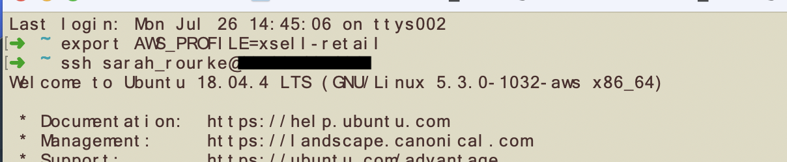
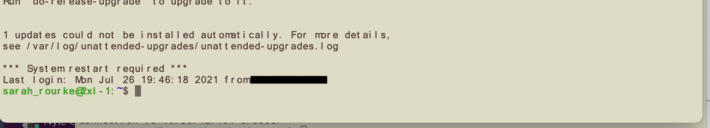

# Client Audio File to JSON Conversion

How to transcribe client audio files to JSON format for Ontologists' & Annotators' needs in the AppStream environment
>Current as of July 22, 2021

## Requirements

* **mac OS** Big Sure 11.4
* **VPN** connection
* **AWS CLI Installed on your local machine**
* **ssh access to sftp server** in xsell-retail/relevant account
* **Server username & password** ask team lead/Justin Doyle
* **Access to the [Convert and Transcribe](https://github.com/XSell/convertAndTranscribe) GitHub Repo**
* **Node v14.17.3**
    >you can find the node.js download [here](https://nodejs.org/en/)

Servers to use (us-east-1, xsell-retail in aws)

| **10.30.12.104** | _EC2 instance xspd-efs03_ |
| --- | --- |
| **10.30.12.160** | _EC2 instance xspd-efs02_ |

This guide assumes the following,

-The [NVM](https://github.com/nvm-sh/nvm) package manager is installed on your local machine (macOS in this case). If not, run the following command via the CLI:

    curl -o- https://raw.githubusercontent.com/nvm-sh/nvm/v0.38.0/install.sh | bash

or

    wget -qO- https://raw.githubusercontent.com/nvm-sh/nvm/v0.38.0/install.sh | bash

once the download completes, I recommend following the prompts to add the nvm script to your $PATH.
Next you will want to install node.js globally - you can find the node.js download [here](https://nodejs.org/en/)
>If you get the "you do not have the permission to access this file" run _sudo npm install -g npm_
>The -g install the modules globally, omit this if you'd like

    npm install -g npm

-The [AWS CLI v2](https://docs.aws.amazon.com/cli/latest/userguide/install-cliv2-mac.html) is installed on your your local machine and the coordinating credentials have been added to your .aws credentials file, and the aws profile set to _default_.
If not, run the following commands via the CLI:

    curl "https://awscli.amazonaws.com/AWSCLIV2.pkg" -o "AWSCLIV2.pkg"
    
    sudo installer -pkg AWSCLIV2.pkg -target /

and to set the credentials and session profile:

    aws configure --profile xsell-retail

_fill in the AWS keys with your own keys - the below is an example pulled from the AWS CLI docs found [here](https://docs.aws.amazon.com/cli/latest/userguide/cli-configure-quickstart.html)_

    AWS Access Key ID [None]: *
    AWS Secret Access Key [None]: *
    Default region name [None]: us-east-1
    Default output format [None]: json

### Getting at it

The first step is to set your aws-cli profile to correspond with the correct account, you can do this with the following commands

    export AWS_PROFILE=xsell-retail

Next, ssh into the server - make sure you have access to this server to save yourself a lot pain from being _blocked_ due to access issues
To do this, run this command in the CLI

    ssh user_name@ip

You should now be connected the ec2 instance and your terminal will look something like this;

>

and once you're logged in,

>

______

## After login/ssh-ing into the server

*_remember to make sure you have npm, node, and ffmpeg installed before running the transcript_

The first step is to create a new folder to sync the client's stream data into - if there is more than one file to transcribe for a client please label accordingly, so run this command,

    mkdir /mnt/efs/$CLIENT_FOLDER_NAME

You'll then sync the aws-s3 bucket (already in the remote server) into the new folder you created for the specific client - in this case, Anthem,

    aws s3 sync s3://xshpdsftp2-s-ec8c6c62aeee41cc8/upload/ /mnt/efs/anthem/audio

Next, clone the [_convertAndTranscribe_](https://github.com/XSell/convertAndTranscribe) into your home directory on the server
cd into the repo's main directory and install the necessary dependencies as seen in the example code snippet below below,

    git clone https://github.com/XSell/convertAndTranscribe
    cd convertAndTranscribe
    npm install

## Transcribe

Once you're logged into the server and cd-ed yourself into the repositories main directory, run `tmux new -s $CLIENT_NAME`
Then in the tmux window that should have popped open, run the following,

    node convertAndTranscribe /mnt/efs/$CLIENT_NAME/audio/ /mnt/efs/$CLIENT_NAME/audio-converted/ /mnt/efs/$CLIENT_NAME/json

this will begin the transcribing process which wil activily run in you terminal. To monitor the process, split your active terminal window by pressing 
>Ctrl and b at the same time
>on release press shift and '%'
>*_assuming you're working on a ma_

In the newly split terminal window, run,

    tmux new -s status

And in the new tmux session window, run,

    node status.js /mnt/efs/$CLIENT_NAME/json/ /mnt/efs/$CLIENT_NAME/audio

Once it is done kill both node processes,
    ctrl c in "status" window - kills process
    ctrl d in "status" window - closes window
    ctrl c in original tmux session window - kills transcribing process. 

Just a heads up - the code currently does not end on its own, so you will get a repetitive output on the active trascribing terminal window until you kill the process.

This should be all you need to do per file - definitely ask for help if needed - I know I sure did.

## Resources

* Github repo for node script - also has helpful code instructions to get you started

    https://github.com/XSell/convertAndTranscribe
