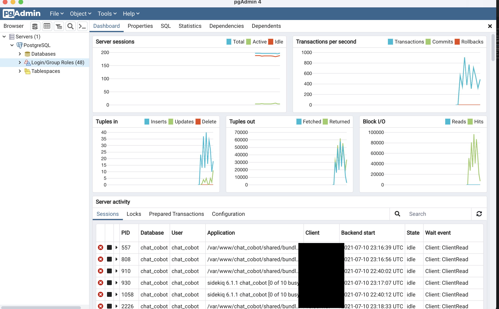
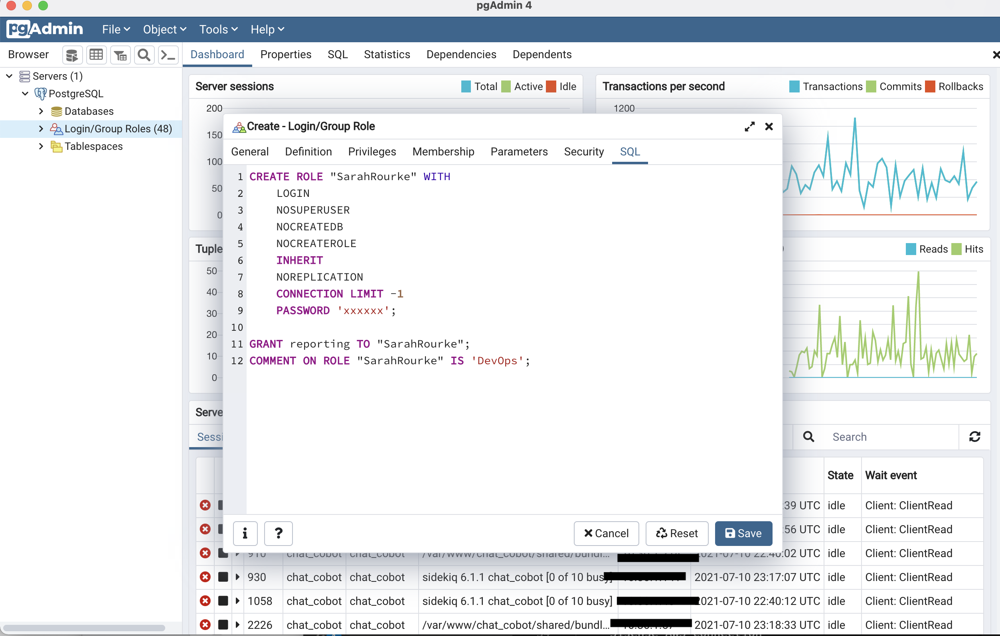

# Granting User Access: postgreSQL DB - Reporting/Read-Only

How to grant reporting or read-only access to postgreSQL databases/servers. The first portion explains granting access via the CLI, while the second portion explains the process while working in the pgAdmin UI.
>_Current as of July 7, 2021_

## Requirements

* **mac OS** Big Sur 11.4
* **Homebrew** or other package manager
* **VPN** connection
* **Username and generated Password** for the username use `firstnamelastname` syntax - one word, all lowercase and for password `password`, type=string
* **DB/Server Host/Name** that you're granting the user access to
* Master **DB/Server credentials** from 1password

This guide assumes [homebrew](https://brew.sh/) is installed on your local machine (macOS in my case). If not, run the following command via the CLI:

    /bin/bash -c "$(curl -fsSL https://raw.githubusercontent.com/Homebrew/install/HEAD/install.sh)"

once the download completes, follow the prompts to add the brew command to your $PATH.

## Installing Postgres via Brew (macOS)

From the CLI run

    brew install postgres

Start running the psql server in the background

    brew services start postgres

Next, connect to psql server

    psql -U [username] -p [port number] -h [server host]

Example: if connecting to the chat_cobot production db the command would look like this:

    psql -U chat_cobot -p PORT -h xspd-chat-cobot-verizon.example.url.from.amazonaws.com

You will then be prompted to enter the password (from 1password) associated with the username.

Type in the password associated with the username - _DevOps Team can find master passwords in 1password._ If everything is valid, you will then connect to the psql server. The CLI output should look something like this:

    Password for user chat_cobot: 
    psql (13.3, server 11.10)
    SSL connection (protocol: TLSv1.2, cipher: ECDHE-RSA-AES256-GCM-SHA384, bits: 256, compression: off)
    Type "help" for help.

    chat_cobot=>

You can now list all login/group roles and their current granted-access with this quick command Bryan used while explaining this process;

    chat_cobot=>\du+

stdout:

Most likely, your list of login/group roles will look different than mine. I added a file in my home directory with the name .psqlrc - I first nano the file from my home directory and then add the text for commands that psql will read over every time I view a table while working in the psql server. Checkout the CLI example of how to add this below:

In your terminal run

    nano $HOME/.psqlrc

An empty text file will open in the terminal, enter the following lines

    \pset linestyle unicode
    \pset border 2
    select * from t; 

Then use `^x` to quit and enter `y` when it prompts you to save the file before closing it.
And now your psql tables should come out neat and tidy - i.e. much easier to read.

_

### Creating Users/Roles and Granting Access

While connected to the specific database server - chat_bot for this example, run the following in your terminal:

_*I used ipython to generate a random password_

If you run the `\du+` command again, you should see the newly added user/role and their granted access

To exit postgres use the command `\q` and to stop the postgres server running in the background run

    brew services stop postgres

your terminal should look something like this

_________________

### Upon Completion

Make sure to let the user know that you have granted them access to the database, and ask them to confirm with you that they were able to get the resources they need. Only grant 'reporting' or 'read only' if a user wants 'write' access, discuss with others on the team if it is ok to give them such access. For the sake of keeping production databases unaltered.

_________________

# Access DB Server via pgAdmin UI

## Requirements.2

* **pgAdmin 4**  
downloaded to your local machine for desktop use
* **VPN** connection
* **Username and generated Password** for the username use `firstnamelastname` syntax - one word, all lowercase and for password `password`, type=string
* **DB/Server Host/Name** that you're granting the user access to
* Master **DB/Server credentials** from 1password

_________________

Open the desktop UI for pgAdmin - it should like something like this:

>

Enter your system's master password and select 'ok'.
Next, the dashboard will render and you can select 'Add New Server'

>
_*Alternatively you can right click on the tag "Servers" on the left side of the screen and select 'create' then choose to add either a server group, or an individual server_

A new popup window will appear, enter the databases name as **PostgreSQL**:
>

Then click on the next tab to the right listed as 'Connection' and enter the server name/address, port, username, and password:

>
>_*DevOps can find the admin/master credentials in 1password_

Select 'Save' in the bottom right corner - and if all information is current/correct/valid, the connected database will populate the field on the left-side of the screen as seen below
>

_________________

# Adding a new user/role

Right click on the **Login/Group Roles** tab and within the dropdown menu choose _Create_
then select _Login/Group Role_ as shown below
>

Next, within the popup box;

* enter the user's username in the _General_ tab, I also like to add the team name (Data-Science, Ontologist, Developers, etc.) in the 'Comments' | 
* create a password (save it somewhere safe to give the user) and enter it in password textbox in the _Definition_ tab, leaving the Expiry date blank | 
* in the _Privileges_ tab, set 'Can login?' to 'Yes' | 
* the _Membership_ tab should specify 'reporting' | 
* as of 7.10.21 we do not set anything in _Parameters_ or _Security_
* finally, check the _SQL_ tab to ensure the user's information is correct | 
* select 'Save'

The new user/group/role is now saved, added, and granted access to the database server. Send the user their username and password and ask that they confirm they can access the resources they need

_________________

## Resources

* Github repo

* Homebrew  
    https://brew.sh/

* Postgres
    https://www.postgresql.org/

    Tips and tricks
    https://pgdash.io/blog/postgres-psql-tips-tricks.html

    pgAdmin
    https://www.pgadmin.org/
