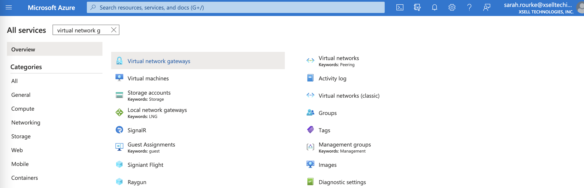
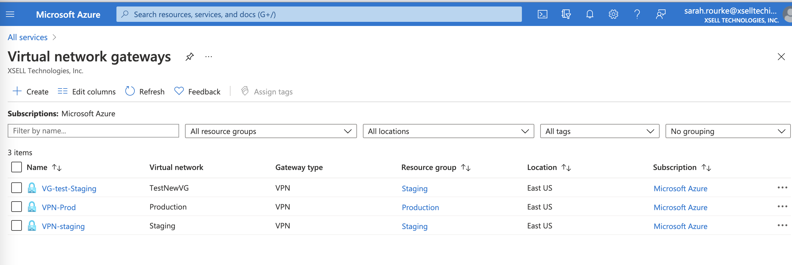
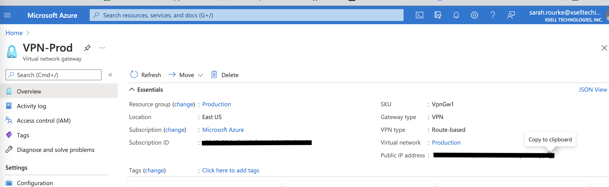
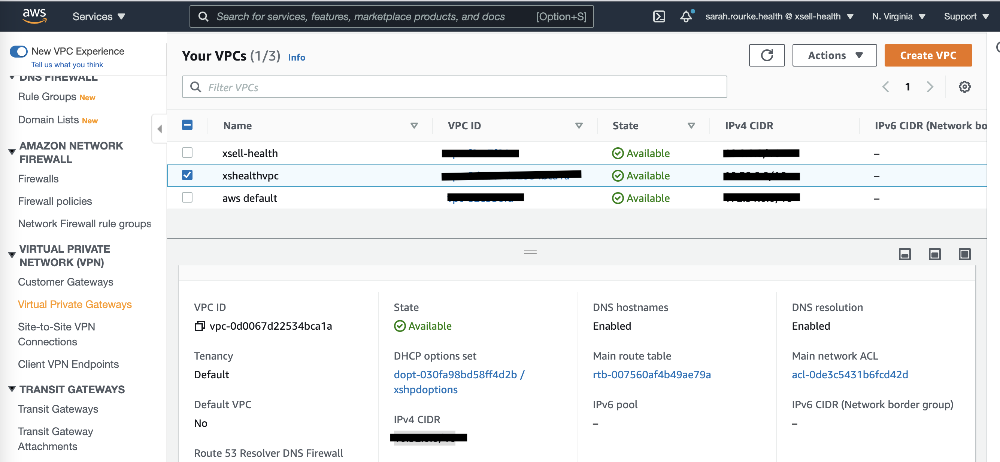
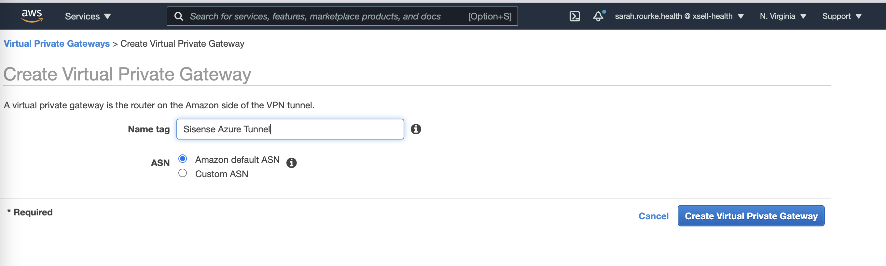
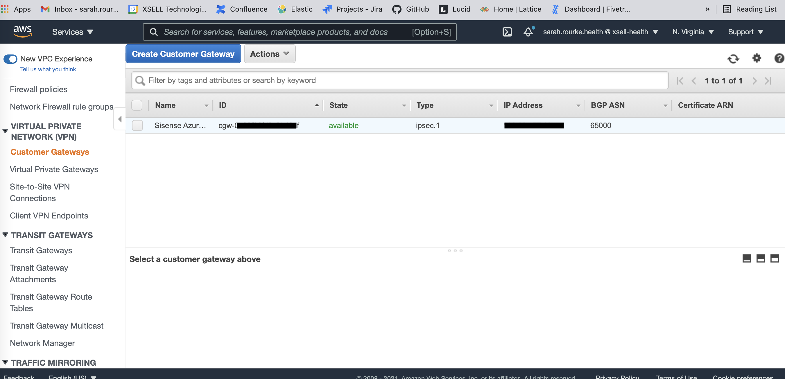
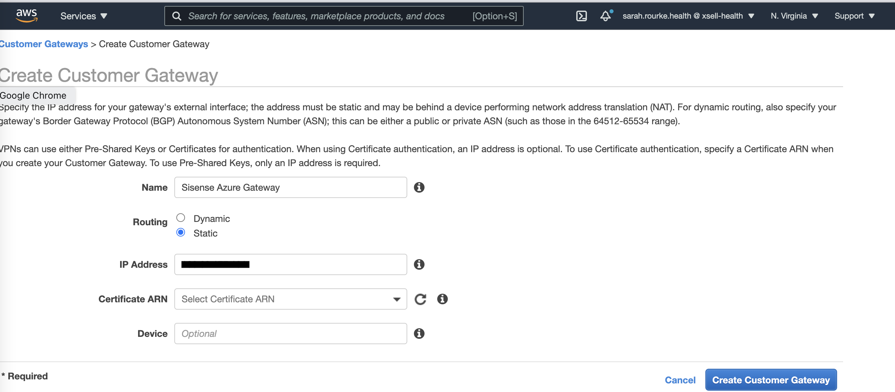
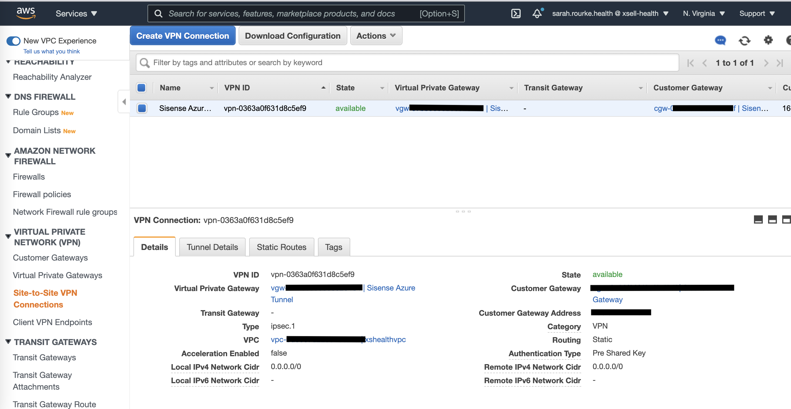

# Creating a secure VPN connection between AWS and Azure

How to configure and connect an AWS database server instance to an Azure database using a private VPN. The purpose of the connection is to transfer an existing resource database in AWS to Azure and persist incoming data in the Azure database and delete the AWS instance - per request of client. The intention is to forego using 3rd-party services to ensure the VPN and transferred data are secure from public access.
>_Current as of July 11, 2021_

## Requirements

* **mac OS** Big Sur 11.4
* **AWS Admin Access**
* **Azure Admin Access**
* **Server Info** */edit this/*

This guide assumes you have access to the AWS management console and database server information along with Azure's Admin access. The resources created will be charged to the owner of the accounts. The steps will be numbered and labeled due to the nature of switching between AWS and Azure accounts.

Throughout the configuration, you will need the following information at various points. In some cases you will be making new elements and in others, the information will already exist. Nonetheless it is helpful to document the information prior to beginning for easy reference, or to document it as you build and to help those who work with you or after you on the same project.

**AWS** - VPC Virtual Private Cloud for Sisense that will be used in tandem with the Virtual Private Gateway you will build.

| name | VPC ID | IPv4 CIDR |
| --- | ----- | --------- |
| xshealthvpc | vpc-* | *.*.*.*/16 |

**Azure** - Virtual Private Gateway in Azure that will be used for building the site-to-site connection

| name | resource group | SKU | location | gateway type | VPN type | virtual network | Public IP |
| --- | --- | --- | --- | --- | --- | --- | --- |
| VPN-Prod | Production | ** | East Us | VPN | Route-based | Production | *.*.*.* (VPN-Production-public-ip) |

In AWS VPN page of the health profile, navigate to the Site to Site VPN Connections sidebar menu option.
Select "create VPN Connection"

### Azure

1. In Azure create the Virtual Gateway or use one that already exists. For this case we are using this already existing [VPN-Prod Gateway](https://portal.azure.com/#@xselltechinc.onmicrosoft.com/resource/subscriptions/c88d8b93-be0e-49a7-b4e6-545f26f642fd/resourceGroups/Production/providers/Microsoft.Network/virtualNetworkGateways/VPN-Prod/overview) see Image 1c. Make sure to take note of the information listed above.

>_*From 'view all services' or from the main search bar, simply search for virtual private gateway and then select the matching icon_
> Image 1a
>
>_*List of our Azure Virtual Private Gateways - select VPN-Prod_
> Image 1b
>
>_*Take note of the listed information - super helpful later on!_
> Image 1c

### AWS

2. In AWS Create a new Virtual Private Gateway

* Go to the VPC page of your account and navigate to the _Virtual Private Networks_ section of the left-side scrolling menubar - it is highlighted in yellow. Image 2a
* Then select **Virtual Private Gateways** which will redirect you to the page where you can create a new VPG.
* Select the _Create Virtual Private Gateway_ blue button on the upper left to get started. When naming your new VPG, make sure to relate it in some way to your existing VPC. In this case, it is the VPC for XSell-Health named **xshealthvpc** (see how simple that name is? anyone working on this build would know what that VPC is for). Image 2b
* We named the private gateway _Sisense Azure Tunnel_. This name is another name that makes it easy to know what the VPG is for! It helps others find it when they need to work on it after you. Image 2c
* For this build we left the ARN as default. These steps and pages are shown below to help navigate the build.

>_*Select **Virtual Private Gateways** in yellow on the left. In the new virtual private gateway make sure to name it appropriately and relate it to the VPC (vpc-0d0067d22534bca1a), or whichever VPC you need for your build._
> Image 2a
>
>
>_*Click on the create button to get started_
>
> Image 2b
>
>
>_"Sisense Azure Tunnel"_
>
> Image 2c
>

3. AWS - Create Customer Gateway

* Name: "Sisense Azure Gateway"
    set routing to "static"
    get public IP address of connection point in Azure (the Public IP we wrote down earlier) and enter in the form as the **IP Address**
    _Azure VPN-Prod: Public IP Address: 168.62.177.191 (VPN-Production-public-ip)_

> Image 3a
>
> Image 3b
>

4. AWS - Create VPN Connections

* In AWS go to **Virtual Private Network** in the left-side menu and select "Site-to-Site VPN Connections"
* Select _Create VPN Connection_

>Image 4a
>

* Create relevant tag-name
* Set _Target Gateway Type_ as "Virtual Private Gateway"
* The _Virtual Private Gateway_ drop down menu will contain the gateway you made earlier - starts with "vgw" choose this one
* The _Customer Gateway_ and its _ID_ will also be visible in the drop down menu
* Set _Routing Options_ as "Static" and
Target Gateway Type - Virtual Private Gateway

5. AWS - Customer Gateway Config File

* On the Create VPN Connection landing page, click on the button to the right of the blue "Create VPN Connection" button that says "Download Configuration"
* Once the file is downloaded, open it and take record of the PSK and Public Ip from the Virtual Private Gateway.

Download configuration file from the AWS customer gateway

Get the PSK and Public IP (from virtual private gateway) from the downloaded config file

In Azure,
    go to "local network gateways"

pull cidr block from vpc - (subnet, within the aws vpc for sisense) for the subnet that sinsense 

create local network grateway in Azure
the endpoint ipaddress is the ip address found in the downloaded configuration

the cidr goes into "Address space"
Select Create

In Azure go to "Connections" from drop down menu
    create a new connection 
    site-to-site connection
        select resouce group "Production" (paying resource of company)

        enter "Instance Details"

        under settings

            enter the virtual network gateway that we had already created VPN -Prod
            enter the local network gate "sisense_aws_gateway"
            enter shared key - PSK from configuration from from AWS
                - make sure that the shared key is from the 1st TUnnel
            set IKE Protocol to IKEv2
            skipped over "enable BGP"
            left defaults selected

            click next

            you will see the Create Connect page with Details
            Shared key = PSK

            Deployment In Progress
            

            Under resources select "Connections"

            On this page you will watch for the status to change from "Not Connected" to "Connected"

    get the ip from the VM in Azure as the public ip - ?

    2nd try to make connection in Azure

Create local network gateway
enter a name

endpoint -  ip
ip is outside ip address from downloaded config

Address space
    enter cidr from aws 10.32.8.0/24

In sisense

add data

    db type - select: postgreSQL

    ip of database server: 10.10.0.18

    db port: 5432

    username: sisense

    password: 

    

____________________

## Resources

* Tutorial we referenced
[Site-to-site-vpn-between-aws-and-azure](https://infra.engineer/azure/52-site-to-site-vpn-between-aws-and-azure)
