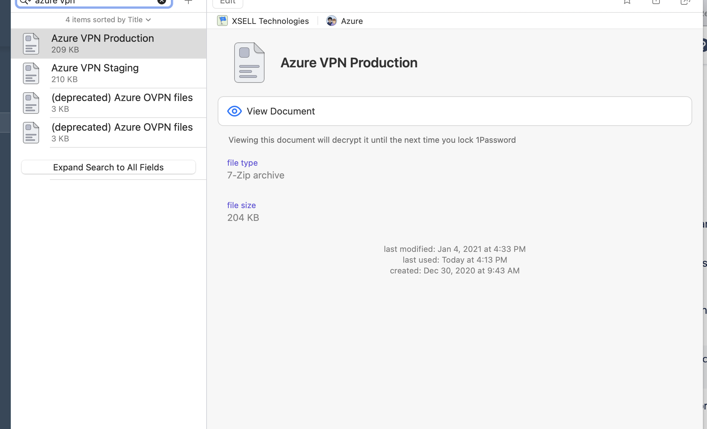
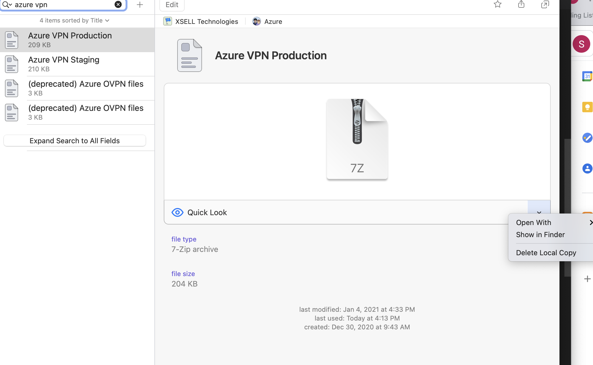
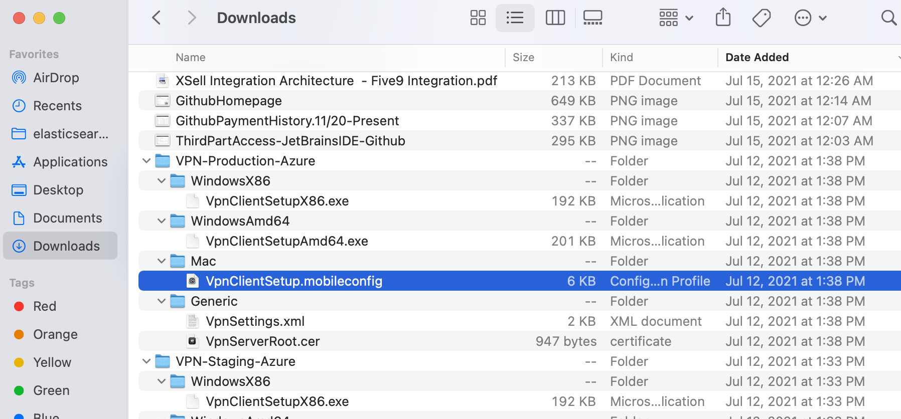
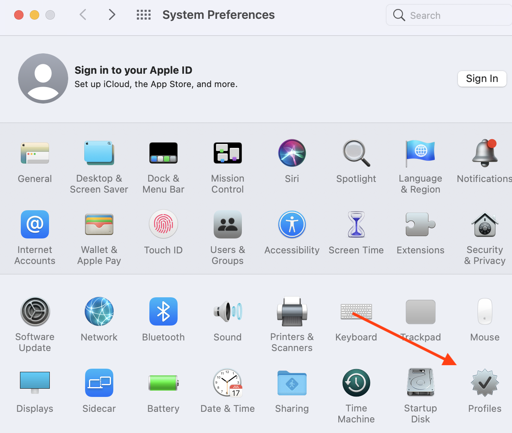
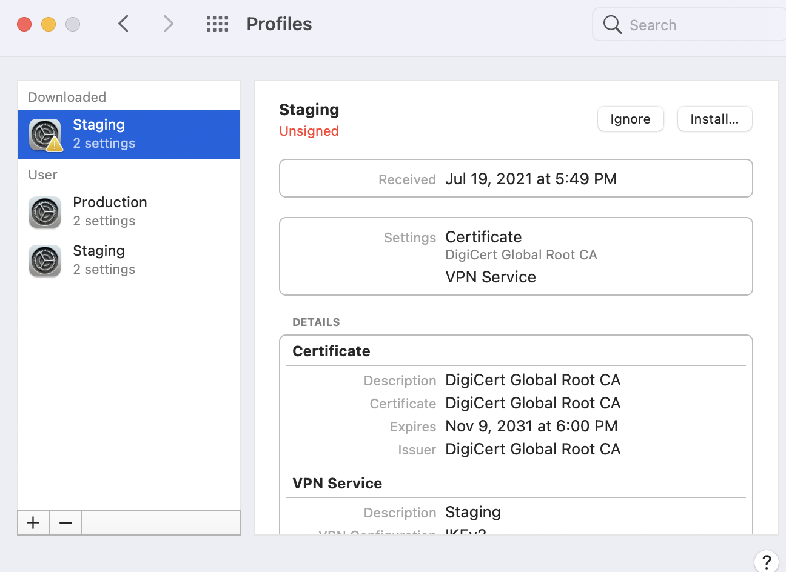
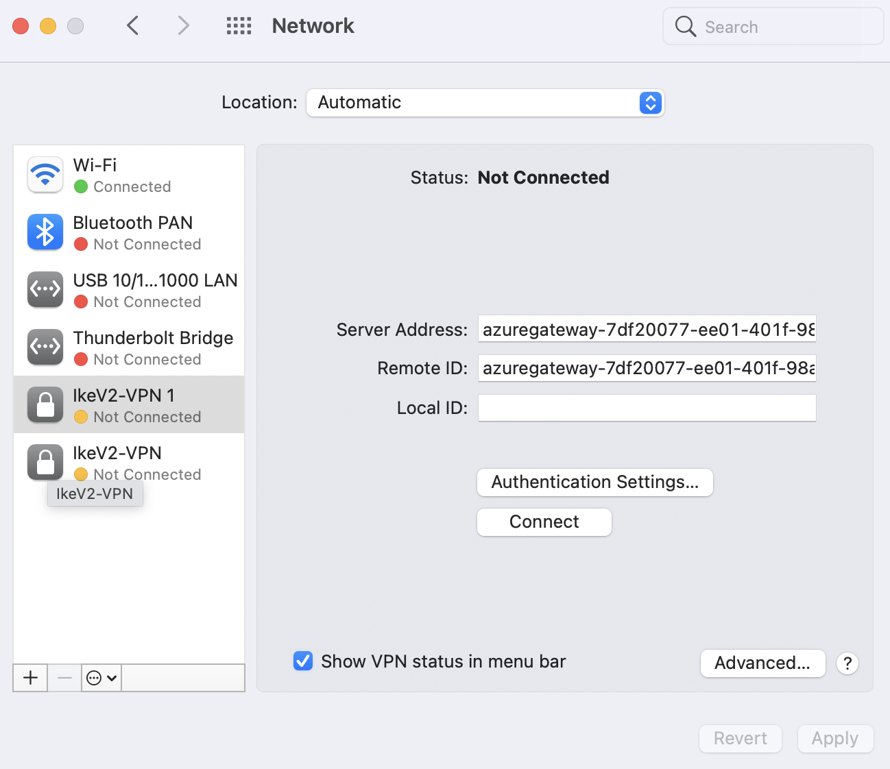

# Azure VPN Setup on Local Machine and Access to Azure Portal

How to setup and connect to XSell's Azure specific VPN. The second portion will cover the login procedure and resources for Azure portal.
    _Current as of July 19, 2021_

## Requirements

- mac OS Big Sure 11.4
- Access to 1password Azure VPN Files
- Received Azure login credentials from team lead
- Login email syntax firstname.lastname@sxelltechinc.onmicrosoft.com
- Password will be given to you once you are added as a user

This guide assumes you have the necessary configuration files for the Azure VPN Procution and Staging environtments. If you don't, request access to these files in 1password.

Once you have access to the VPN files in 1password, download the zip files and select the **Mac** folder and internal file.

>

Select _Show in finder_

>

Select the folder and file for your operating system (mac used here)

>

The system will notify you, directing you to add the configuration in **Profiles**
I added an arrow because I had never even seen that option in system preferences before

>

In profiles - select _Install_ in the upper right corner

>

Next go to **Network** in System Preferences and you should see the **IkeV2-VPN** option in the leftside menu

>

Select **Connect** and input your credentials for the VPN - request these if you don't have them already

You should now be connected to the VPN! If not, please ask for help. Please add any detail to this documentation that you think would be helpful

## Azure Portal

For logging into the Azure Portal, you just need your Azure credentials and then to set up MFA

This is the link for the Azure Portal
    <https://azure.microsoft.com/en-us/features/azure-portal/>
